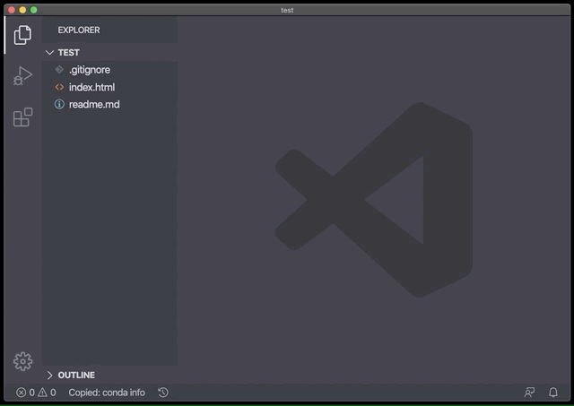
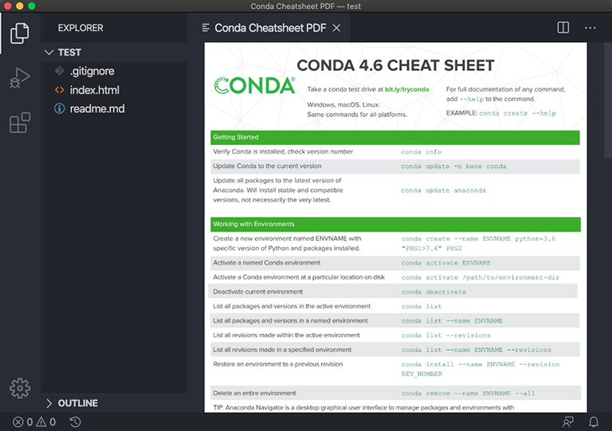
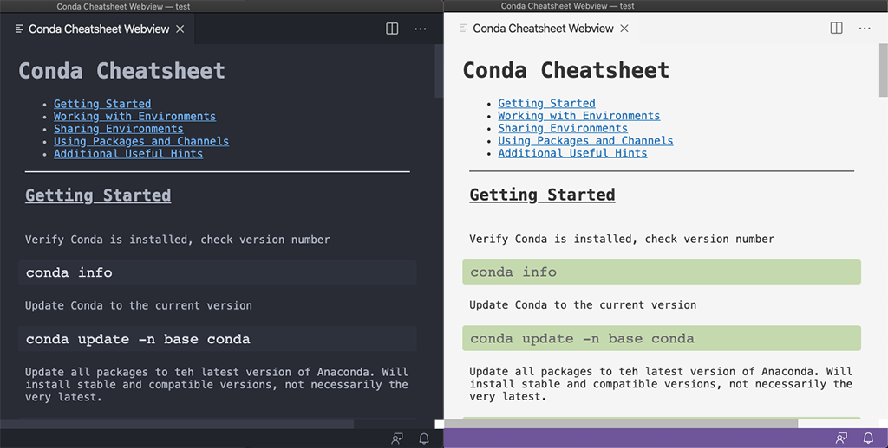

# [Conda Cheatsheet](https://marketplace.visualstudio.com/items?itemName=jojoee.conda-cheatsheet)
A Visual Studio Code extension that lets you open Conda cheatsheet inside the editor.

[](https://travis-ci.org/jojoee/vscode-conda-cheatsheet)
[](https://marketplace.visualstudio.com/items?itemName=jojoee.conda-cheatsheet)
[](https://marketplace.visualstudio.com/items?itemName=jojoee.conda-cheatsheet)
[](https://marketplace.visualstudio.com/items?itemName=jojoee.conda-cheatsheet)





## Features
- `Conda Cheatsheet: PDF` to open PDF file inside editor
- `Conda Cheatsheet: Website` to open website inside editor
- `Conda Cheatsheet: Webview` to open website inside editor
  - Support both light and dark theme
  - Click on the content section for jump to selected section immediately
  - Copy and Paste command

## TODO
- [ ] Automated: download pdf => convert to image for `onCommand:extension.openPdf` command
- [ ] Automated: [Automated publishing](https://code.visualstudio.com/api/working-with-extensions/continuous-integration#automated-publishing)
- [ ] Automated: test
- [ ] Automated: watch and run `compileWebVie.js` file
- [ ] Refactoring

## Demo
1. Basic usage + feature
- `alt + shift + P` to open available commands
- Select for open "Webview"
- Click to "Sharing Environments" section
- Hover on some command
- Click it for copy the command
- `alt + N` to create new file
- `alt + V` to pate the command
2. Support theme changing
3. Support other view e.g. PDF and website

## Development
```
node tool/compileWebVie.js && npm run compile
```
